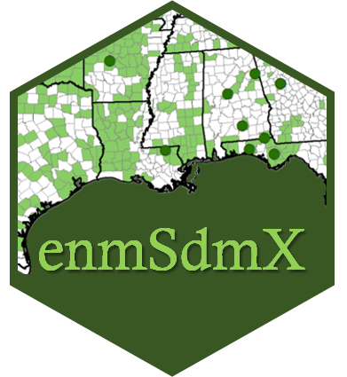

# enmSdmX
<!-- badges: start -->

<!-- badges: end -->

<strong>Tools for modeling niches and distributions of species </strong>

`enmSdmX` is a set of tools in <b>R</b> for implementing species distribution models (SDMs) and ecological niche models (ENMs), including: bias correction, spatial cross-validation, model evaluation, raster interpolation, biotic velocity (speed and direction of movement of a "mass" represented by a raster), and tools for using spatially imprecise records. The heart of the package is a set of "training" functions which automatically optimize model complexity based number of available occurrences. These algorithms include MaxEnt, MaxNet, boosted regression trees/gradient boosting machines (BRT), generalized additive models (GAM), generalized linear models (GLM),	natural splines (NS), and random forests (RF). To enhance interoperability with other packages, the package does not create any new classes. The package works with PROJ6 geodetic objects and coordinate reference systems.

## Installation ##
You can install this package from CRAN using:

`install.packages('enmSdmX', dependencies = TRUE)`

Alternatively, you can install the development version of this package using:

`remotes::install_github('adamlilith/enmSdmX', dependencies = TRUE)`  

You may need to install the `remotes` package first.

# Functions #

### Using spatially imprecise records
* `coordImprecision`: Coordinate imprecision
* `nearestGeogPoints`: Minimum convex polygon from a set of spatial polygons and/or points ("nearest geographic point" method)
* `nearestEnvPoints`:  Extract "most conservative" environments from points and/or polygons ("nearest environmental point" method)

### Data preparation ###
* `elimCellDuplicates`: Eliminate duplicate points in each cell of a raster
* `geoFold`: Assign geographically-distinct k-folds
* `geoFoldContrast`: Assign geographically-distinct k-folds to background or contrast sites

### Bias correction
* `geoThin`: Thin geographic points deterministically or randomly
* `weightByDist`: Proximity-based weighting for occurrences for correcting spatial bias

### Model training ###
* `trainByCrossValid` and `summaryByCrossValid`: Calibrate a distribution/niche model using cross-validation
* `trainBRT`: Boosted regression trees (BRTs)
* `trainESM`: Ensembles of small models (ESM)
* `trainGAM`: Generalized additive models (GAMs)
* `trainGLM`: Generalized linear models (GLMs)
* `trainMaxEnt`: MaxEnt models
* `trainMaxNet`: MaxNet models
* `trainNS`: Natural splines (NSs)
* `trainRF`: Random forests (RFs)  

### Model prediction ###
* `predictEnmSdm`: Predict most model types using default settings; parallelized
* `predictMaxEnt`: Predict MaxEnt model
* `predictMaxNet`: Predict MaxNet model

### Model evaluation ###
* `evalAUC`: AUC (with/out site weights)
* `evalMultiAUC`: Multivariate version of AUC (with/out site weight)
* `evalContBoyce`: Continuous Boyce Index (with/out site weights)
* `evalThreshold`: Thresholds to convert continuous predictions to binary predictions (with/out site weights)
* `evalThresholdStats`: Model accuracy based on thresholded predictions (with/out site weights)
* `evalTjursR2`: Tjur's R2 (with/out site weights)
* `evalTSS`: True Skill Statistic (TSS) (with/out site weights)
* `modelSize`: Number of response values in a model object

### Niche overlap and comparison ###
* `compareResponse`: Compare different niche model responses along an environmental variable
* `nicheOverlapMetrics`: Niche overlap metrics

### Functions for rasters ###
* `bioticVelocity`: Velocity of a "mass" across a time series of rasters
* `getValueByCell` and `setValueByCell`: Retrieve or get raster values(s) by cell number
* `globalx`: "Friendly" wrapper for terra::global() for calculatig raster statistics
* `interpolateRasts`: Interpolate a stack of rasters
* `longLatRasts`: Generate rasters with values of longitude/latitude for cell values
* `sampleRast` : Sample raster with/out replacement
* `squareCellRast`: Create a raster with square cells from an object with an extent

### Coordinate reference systems ###
* `crss`: Coordinate reference systems and their nicknames
* `customAlbers`: Create a custom Albers conic equal-area projection
* `customLambert`: Create a custom Lambert azimuthal equal-area projection
* `customVNS`: Create a custom vertical near-side projection
* `getCRS`: Return a WKT2 (well-known text) string using a nickname

### Geographic utility functions ###
* `countPoints`: Number of points in a "spatial points" object
* `decimalToDms`: Convert decimal coordinate to degrees-minutes-seconds
* `dmsToDecimal`: Convert degrees-minutes-seconds coordinate to decimal
* `extentToVect`: Convert extent to a spatial polygon
* `plotExtent`: Create a spatial polygon the same size as a plot region
* `spatVectorToSpatial`: Convert SpatVector object to a Spatial* object

### Data
* `lemurs`: Lemur occurrences
* `mad0`: Madagascar spatial object
* `mad1`: Madagascar spatial object
* `madClim`: Madagascar climate rasters for the present
* `madClim2030`: Madagascar climate rasters for the 2030s
* `madClim2050`: Madagascar climate rasters for the 2050s
* `madClim2070`: Madagascar climate rasters for the 2070s
* `madClim2090`: Madagascar climate rasters for the 2090s

# Citation #

Smith, A.B., Murphy, S.J., Henderson, D., and Erickson, K.D. 2023. Including imprecisely georeferenced specimens improves accuracy of species distribution models and estimates of niche breadth.  <i>Global Ecology and Biogeography</i> In press. [<b><a href='http://dx.doi.org/10.1101/2021.06.10.447988'>open access pre-print</a></b> | <a href='https://doi.org/10.1111/geb.13628'>published article</a></b>]

<b>Abstract</b>

<b>Aim</b> Museum and herbarium specimen records are frequently used to assess the conservation status of species and their responses to climate change. Typically, occurrences with imprecise geolocality information are discarded because they cannot be matched confidently to environmental conditions and are thus expected to increase uncertainty in downstream analyses. However, using only precisely georeferenced records risks undersampling of the environmental and geographical distributions of species. We present two related methods to allow the use of imprecisely georeferenced occurrences in biogeographical analysis.

<b>Innovation</b> Our two procedures assign imprecise records to the (1) locations or (2) climates that are closest to the geographical or environmental centroid of the precise records of a species. For virtual species, including imprecise records alongside precise records improved the accuracy of ecological niche models projected to the present and the future, especially for species with c. 20 or fewer precise occurrences. Using only precise records underestimated loss of suitable habitat and overestimated the amount of suitable habitat in both the present and the future. Including imprecise records also improves estimates of niche breadth and extent of occurrence. An analysis of 44 species of North American <i>Asclepias</i> (Apocynaceae) yielded similar results.

<b>Main conclusions</b> Existing studies examining the effects of spatial imprecision typically compare outcomes based on precise records against the same records with spatial error added to them. However, in real-world cases, analysts possess a mix of precise and imprecise records and must decide whether to retain or discard the latter. Discarding imprecise records can undersample the geographical and environmental distributions of species and lead to mis-estimation of responses to past and future climate change. Our method, for which we provide a software implementation in the `enmSdmX` package for <b>R</b>, is simple to use and can help leverage the large number of specimen records that are typically deemed "unusable" because of spatial imprecision in their geolocation.
